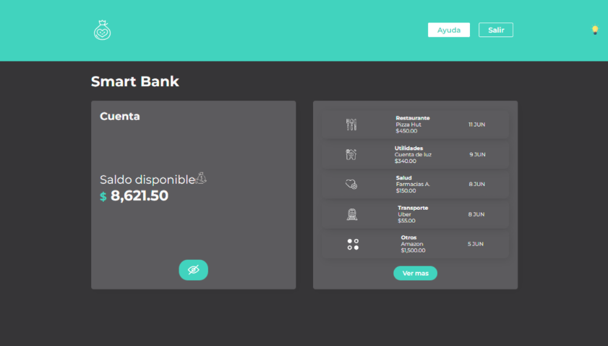

# Oracle ONE | Curso - React: Utilizando Styled Components

     

     

### ¡Bienvenido a mi repositorio! Si te gusto agradecería:

#### Marca este proyecto con una estrella ⭐
#### Sigueme en mi cuenta de GitHub ❤️
---

## ¿Cómo descargar el repositorio?
---
Para descargar el archivo: Puede hacer clic en el botón verde con el nombre "Code" en la parte superior derecha y luego Descargar zip/Download zip. Luego puede abrir el archivo en su editor preferido 

     

